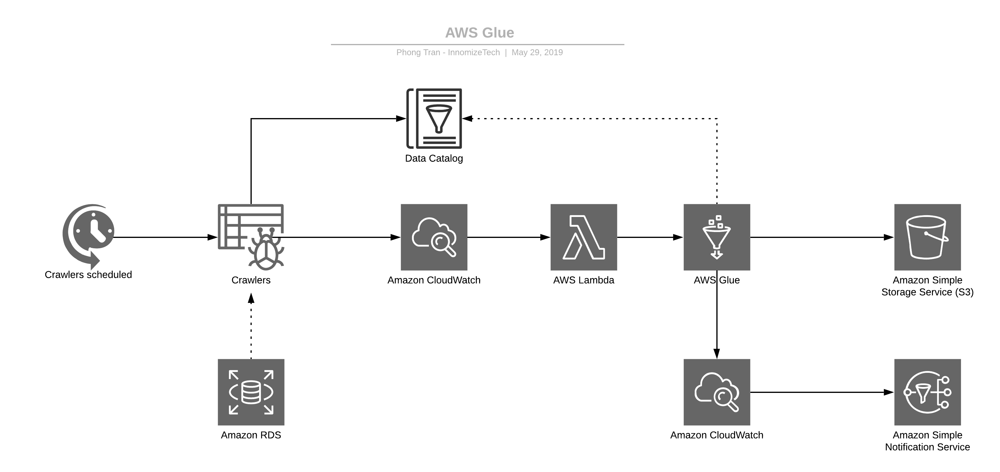

# Serverless ETL Pipeline

This repository contains the code for implementing a *serverless* **data processing pipeline** that performs *Extract-Transform-Load (ETL)* operations using AWS Lambda, Google Cloud Functions, or *Azure Functions*. The pipeline is designed to handle large volumes of data, making it suitable for big data applications in cloud-based environments.

## Overview

The **serverless ETL pipeline** uses a combination of cloud-based services and technologies to perform data processing tasks. The pipeline consists of the following components:

- **Source Data** : The data source, which can be a file, database, or data stream.
- **ETL Functions** : Serverless functions that perform the ETL operations on the data, using a framework such as Apache Spark, Apache Flink, or AWS Glue.
- **Data Storage** : A cloud-based storage service, such as Amazon S3, Google Cloud Storage, or Azure Blob Storage, used to store the processed data.
- **Data Warehouse** : A cloud-based data warehouse, such as Amazon Redshift, Google BigQuery, or Azure Synapse Analytics, used to store the processed data in a structured format.

The serverless ETL pipeline is designed to be scalable, fault-tolerant, and cost-effective. It can be deployed in a variety of cloud-based environments, including AWS, Google Cloud, and Azure, depending on your specific needs.

## Architecture

The serverless ETL pipeline architecture consists of the following components:

 
## Components
 
- **AWS Lambda, Google Cloud Functions, or Azure Functions** : These are the serverless compute services used to run the ETL functions.
- **Apache Spark, Apache Flink, or AWS Glue** : These are the frameworks used to perform the ETL operations on the data.
- **Amazon S3, Google Cloud Storage, or Azure Blob Storage** : These are the cloud-based storage services used to store the processed data.
- **Amazon Redshift, Google BigQuery, or Azure Synapse Analytics** : These are the cloud-based data warehouses used to store the processed data in a structured format.
- **API Gateway or Cloud Endpoints** : These are the API management services used to expose the serverless functions as RESTful APIs.

## Workflow

The serverless ETL pipeline workflow consists of the following steps:

- **Extract** : The data is extracted from the source data storage service.
- **Transform**: The data is transformed using the ETL functions, which are triggered by an event or scheduled to run at regular intervals.
- **Load** : The processed data is loaded into the data storage service and the data warehouse.
- **Query** : The processed data can be queried using SQL or other data analysis tools.

## Getting Started

To get started with the serverless ETL pipeline, follow these steps:

* Clone this repository to your local machine.
* Choose your cloud platform of choice (AWS, Google Cloud, or Azure) and set up the necessary credentials and services.
* Modify the configuration files in the `config` directory to specify the source data, ETL functions, data storage, and data warehouse settings.
* Deploy the ETL functions and API Gateway or Cloud Endpoints to your cloud platform using the appropriate deployment tools.
* Trigger the ETL functions manually or schedule them to run at regular intervals using the appropriate cloud-based scheduling tools.
* Monitor the ETL pipeline using the appropriate monitoring tools provided by your cloud platform.

## Contributing

Contributions to the serverless ETL pipeline are welcome! To contribute, follow these steps:

1. Fork this repository
2. Create a new branch for your changes.
3. Make your changes and test them locally using the appropriate testing tools.
4. Commit your changes and push them to your forked repository.
5. Create a pull request to merge your changes into the main repository.
6. Your pull request will be reviewed by the project maintainers, who will provide feedback and merge it into the main repository if it meets the project's standards.

## Support

If you encounter any issues or have any questions about the serverless ETL pipeline, please open an issue on the project's GitHub repository. The project maintainers will respond to your inquiry as soon as possible.

## License

The **serverless ETL pipeline** is released under the `MIT License`. Please see the [LICENSE](https://github.com/Addax101/serverless-etl-pipeline/blob/main/LICENSE) file for more information.

